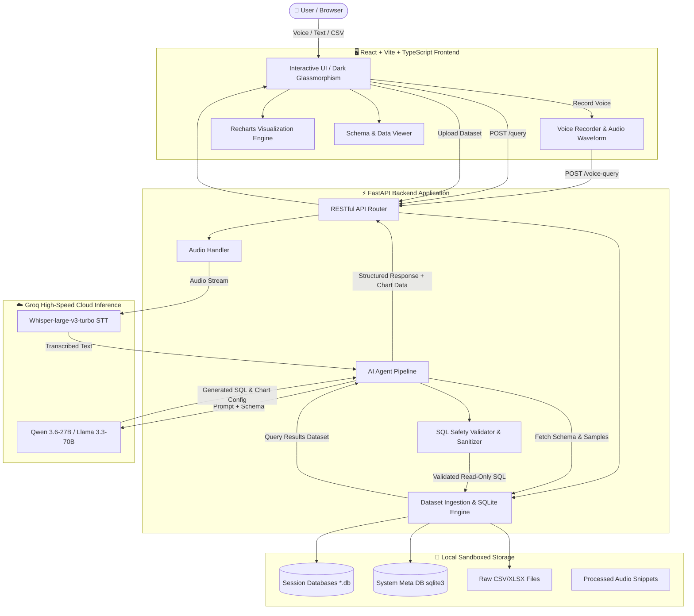

# 🎙️ AI Voice Agent Data Analyzer (VoiceData AI)

<div align="center">

[](https://fastapi.tiangolo.com)
[](https://reactjs.org/)
[](https://www.typescriptlang.org/)
[](https://groq.com/)
[](https://www.sqlite.org/)
[](https://opensource.org/licenses/MIT)

**An intelligent, voice-first autonomous data analytics agent that empowers users to upload datasets (CSV / Excel), ask questions via voice or text in English and Arabic, automatically generates verified SQL, executes sandboxed queries, and renders interactive dynamic charts with AI insights.**

[Key Features](#-key-features) • [Architecture](#-architecture) • [Quick Start](#-quick-start) • [API Reference](#-api-reference) • [Visualizations](#-supported-visualizations) • [Security](#-security--sql-guardrails)

</div>

---

## 🌟 Overview

**AI Voice Agent Data Analyzer** bridges the gap between raw tabular datasets and human decision-making. By leveraging ultra-fast **Groq Whisper-large-v3-turbo** for voice transcription and state-of-the-art LLMs (**Qwen 3.6-27B / Llama 3.3-70B**) for SQL reasoning, it enables business users, data analysts, and researchers to talk directly to their data in natural language.

Whether asking *"Which product category yielded the highest profit margin in Q3?"* or *"ما هي المحافظات الأكثر تسجيلاً للمبيعات هذا العام؟"*, the agent understands context, writes optimized SQL, audits the query for security, executes it on an isolated SQLite database, and returns instant answers alongside rich interactive charts.

---

## ✨ Key Features

- 🎙️ **Voice-First Analysis**: Record audio questions directly from the browser; transcribed in real-time with millisecond latency via Groq Whisper.
- 🌍 **Full Bilingual Support (Arabic & English)**: Native support for Arabic and English prompts, Unicode Arabic table/column headers, and right-to-left UI ergonomics.
- 🧠 **Autonomous SQL Agent**: Converts conversational questions into ANSI/SQLite queries with automated schema discovery and sample data reasoning.
- 🛡️ **Zero-Trust SQL Sandboxing**: Strict validation pipeline that blocks mutating statements (`DROP`, `DELETE`, `UPDATE`, `INSERT`, `ALTER`, `ATTACH`, `EXEC`) to prevent SQL injection or data corruption.
- 📊 **Smart Auto-Visualization**: Recharts-powered interactive charts (Bar, Line, Area, Pie, Radar, Scatter, and Data Tables) generated automatically based on query dimensions and metrics.
- 📂 **Multi-Format Ingestion**: Upload `.csv`, `.xlsx`, or `.xls` files. Automated column type casting, missing value handling, and column sanitization.
- 💬 **Multi-Session History**: Create, rename, switch, and delete multiple analysis sessions with fully persistent conversation and execution logs.
- ⚡ **Sleek Modern UI**: Premium dark glassmorphism design with responsive waveforms, data schema inspect modals, raw SQL viewers, and quick prompt chips.

---

## 🏗️ Architecture



---

## 📁 Repository Structure

```
AI-Voice-Agent-Data-Analyzer/
├── backend/                        # FastAPI Python Backend
│   ├── storage/                    # Local runtime storage (sandboxed)
│   │   ├── audio/                  # Stored voice recordings
│   │   ├── databases/              # Per-session SQLite databases
│   │   └── uploads/                # Uploaded raw CSV / Excel files
│   ├── __init__.py
│   ├── agent.py                    # AI Pipeline (Whisper + Groq LLM + SQL Prompting)
│   ├── config.py                   # Environment, model settings, and paths
│   ├── database.py                 # SQLite session management & CSV ingestion
│   ├── main.py                     # FastAPI application endpoints & routing
│   ├── requirements.txt            # Backend dependencies
│   └── sql_safety.py               # SQL validator, sanitizer & security guardrails
│
├── frontend/                       # React 18 + Vite + TypeScript Frontend
│   ├── public/                     # Static assets & icons
│   ├── src/
│   │   ├── assets/                 # SVGs and branding images
│   │   ├── components/             # Reusable UI components
│   │   │   ├── ChartRenderer.tsx   # Recharts dynamic visualization engine
│   │   │   ├── ChatMessage.tsx     # Message bubbles, SQL cards & tables
│   │   │   ├── DataSchemaModal.tsx # Interactive dataset schema & preview modal
│   │   │   ├── Header.tsx          # App navbar, session status & quick actions
│   │   │   ├── Sidebar.tsx         # Sessions manager & file upload dropzone
│   │   │   └── VoiceInputBar.tsx   # Voice recording button & text query bar
│   │   ├── hooks/                  # Audio recording & speech hooks
│   │   ├── services/               # Axios / fetch API client methods
│   │   ├── types.ts                # TypeScript interface definitions
│   │   ├── App.tsx                 # Core application view & state machine
│   │   ├── index.css               # Modern glassmorphism CSS design system
│   │   └── main.tsx                # React root bootstrap
│   ├── index.html
│   ├── package.json
│   ├── tsconfig.json
│   └── vite.config.ts
│
├── tests/                          # Automated backend integration tests
│   └── test_backend.py             # SQL safety, dataset ingestion, and AI tests
│
├── .env.example                    # Template environment variables
├── .gitignore                      # Git ignore file
├── requirements.txt                # Root Python dependencies
└── README.md                       # Documentation
```

---

## 🚀 Quick Start

### 1. Clone the Repository
```bash
git clone https://github.com/AnasOsama2/AI-Voice-Agent-Data-Analyzer.git
cd AI-Voice-Agent-Data-Analyzer
```

### 2. Configure Environment Variables
Copy `.env.example` to `.env` and provide your free [Groq API Key](https://console.groq.com/keys):
```bash
cp .env.example .env
```
Edit `.env`:
```ini
GROQ_API_KEY=gsk_your_groq_api_key_here
WHISPER_MODEL=whisper-large-v3-turbo
LLM_MODEL=qwen/qwen3.6-27b
```

---

### 3. Backend Setup (Python)

Create and activate a virtual environment:
```bash
# Windows (PowerShell)
python -m venv venv
.\venv\Scripts\Activate.ps1

# Linux / macOS
python3 -m venv venv
source venv/bin/activate
```

Install dependencies:
```bash
pip install -r requirements.txt
```

Run the backend server:
```bash
uvicorn backend.main:app --host 127.0.0.1 --port 8000 --reload
```
API Documentation will be accessible at: `http://127.0.0.1:8000/docs`

---

### 4. Frontend Setup (React + Vite)

Open a new terminal window:
```bash
cd frontend
npm install
npm run dev
```
Open your browser at `http://localhost:5173` (or `http://127.0.0.1:8000` if serving bundled static files).

---

## 🧪 Running Automated Tests

A comprehensive integration test suite verifies SQL safety, database schema ingestion, and multilingual AI responses:
```bash
python -m pytest tests/test_backend.py -v -s
# or run directly:
python tests/test_backend.py
```

---

## 📊 Supported Visualizations

The agent automatically formats results into one of the following chart types:

| Chart Type | Best Used For |
|---|---|
| **Bar Chart (`bar`)** | Comparing categorical values (e.g., sales per region, top 5 products). |
| **Line Chart (`line`)** | Trend analysis over chronological time periods (e.g., monthly revenue). |
| **Area Chart (`area`)** | Cumulative continuous volume distributions over time. |
| **Pie Chart (`pie`)** | Proportional breakdown of parts to a whole (percentages). |
| **Radar Chart (`radar`)** | Multi-attribute comparison across distinct dimensions. |
| **Scatter Chart (`scatter`)** | Correlation between two numerical variables. |
| **Data Table (`table`)** | High-density tabular listings and multi-column exports. |

---

## 🔒 Security & SQL Guardrails

To prevent malicious attacks or accidental data corruption:
- **Read-Only Enforced**: Only `SELECT` statements (and CTEs starting with `WITH ... SELECT`) are permitted.
- **Blocked Keywords**: Commands such as `DROP`, `DELETE`, `UPDATE`, `INSERT`, `ALTER`, `CREATE`, `REPLACE`, `TRUNCATE`, `ATTACH`, `DETACH`, `PRAGMA`, and `EXEC` are strictly rejected.
- **Isolated SQLite Instances**: Each session operates inside its own isolated SQLite database file.
- **Query Timeout & Limit**: Queries automatically enforce reasonable limit bounds to prevent memory denial-of-service.

---

## 📡 API Reference

| Method | Endpoint | Description |
|---|---|---|
| `GET` | `/api/health` | Service health and Groq API status |
| `GET` | `/api/sessions` | List all analysis sessions |
| `POST` | `/api/sessions` | Create a new analysis session |
| `GET` | `/api/sessions/{id}` | Retrieve session details, dataset schema, and chat history |
| `PUT` | `/api/sessions/{id}` | Update session title |
| `DELETE` | `/api/sessions/{id}` | Delete a session and its associated database |
| `POST` | `/api/sessions/{id}/upload` | Upload and ingest a CSV or Excel dataset |
| `POST` | `/api/sessions/{id}/query` | Submit a text prompt for AI SQL analysis |
| `POST` | `/api/sessions/{id}/voice-query`| Submit an audio recording (`.wav`, `.webm`, `.mp3`, `.m4a`) |
| `POST` | `/api/sessions/{id}/execute-sql`| Execute a custom validated SQL query directly |

---

## 🤝 Contributing

Contributions, issues, and feature requests are welcome!
1. Fork the Project
2. Create your Feature Branch (`git checkout -b feature/AmazingFeature`)
3. Commit your Changes (`git commit -m 'Add some AmazingFeature'`)
4. Push to the Branch (`git push origin feature/AmazingFeature`)
5. Open a Pull Request

---

## 📜 License

Distributed under the **MIT License**. See `LICENSE` for more information.

<div align="center">
  <sub>Developed by <a href="https://github.com/AnasOsama2">Anas Osama</a></sub>
</div>
